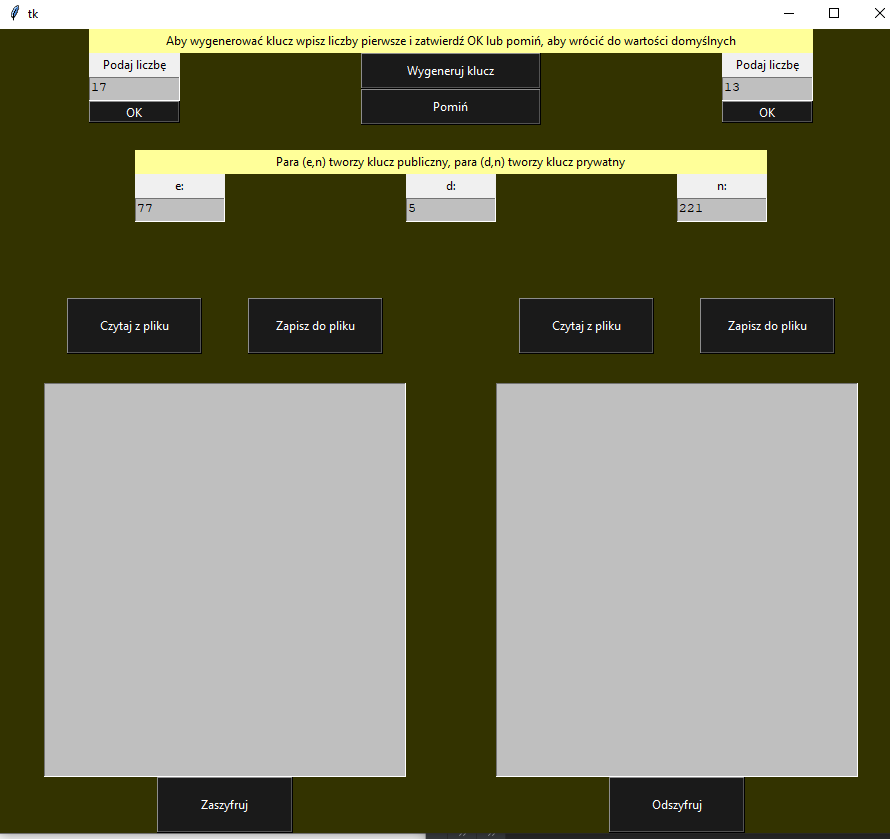

# rsa
Final project in Python3, with library tkinter - RSA implementation (with gui)

Program's aim is to imitate the act of asymmetric encoding -rsa algorithm. It encodes and then decodes every character one by one with quite "small" numbers.
Those are too small to be secure in real life.

Program's GUI is in Polish language.
<<<<<<< HEAD
 
 
 #  Wprowadzenie z opisem teoretycznym algorytmu
 Głównym zadaniem programu jest zasymulować działanie asymetrycznego algorytmu kryptograficznego RSA
  (Rivesta-Shamira-Adlemana algorithm). Program pozwala zobaczyć: jak wygląda zaszyfrowany tekst, 
  w jaki sposób go zaszyfrować oraz odszyfrować, jakie ważne elementy należy wyliczyć aby móc z niego korzystać.
  Program jest jedynie uproszczoną wersją tego algorytmu, ponieważ: 
  
  -koduje każdą literę znak po znaku,
  a nie jak w oryginale, który koduje bloki znaków,
  
  -używa biblioteki rand, która nie zapewnia odpowiedniej pseudolosowości,
  
  -używa bardzo małych liczb pierwszych (powinny mieć one wiele bitów długości).
  
  ### Opis algorytmu
  Bezpieczeństwo tego algorytmu polega na złożoności problemu faktoryzacji (rozkładaniu na czynniki) dużych liczb
  złożonych oraz na asymetryczności (klucz do zaszyfrowania możemy bez obaw upubliczniać klientom, 
  którzy wysyłają nam zabezpieczone dane i tylko my mamy klucz do ich odszyfrowania - stąd nazwy kluczy:
  publiczny - dostępny dla wielu do zaszyfrowania oraz prywatny - przechowywany w sekrecie, tylko dla wyznaczonych 
  do odszyfrowania jednostek).
  
  W celu wygenerowania pary kluczy (prywatnego i publicznego) należy posłużyć się algorytmem:
  
  * Wybieramy losowo dwie duże liczby pierwsze p i q (najlepiej w taki sposób, aby obie miały zbliżoną długość w bitach, 
  ale jednocześnie były od siebie odległe wartościami.
  * Obliczamy wartość n = pq.
  * Obliczamy wartość funkcji Eulera dla n: φ(n)=(p-1)(q-1).
  * Wybieramy liczbę e (1 < e < φ(n)) względnie pierwszą z φ(n).
  * Znajdujemy liczbę d, gdzie jej różnica z odwrotnością modularną liczby e jest podzielna przez  φ(n): d ≡ e^(−1) (mod φ(n)).    
    
    Klucz publiczny jest definiowany jako para liczb **(n, e)**, natomiast kluczem prywatnym jest para **(n, d)**.
  
  Operację szyfrowania przeprowadza się tak, że każdy element który podlega szyfrowaniu wylicza się następująco:
  
  * c = m^e (mod n)
  
  Dzięki wyliczaniu w tej operacji modulo jest to zadanie proste dla komputera nawet dla dużych liczb.
  Jest to bardzo wydajne, ponieważ unika tworzenia dużych liczb pośrednich - metoda binarnego kwadratu i mnożenia.
  
  Operację deszyfrowania tekstu przeprowadza się podobnie, ale z innym kluczem czyli:
   * m= c^d (mod n)
  
 
 # Opis interfejsu 
   Interfejs programu został przedstawiony w formie graficznej. Został on podzielony na 3 sekcje: górną - służąca do generowania nowych 
   kluczy z podanych liczb pierwszych, dolną lewą, w której możemy umieścić tekst do zaszyfrowania oraz dolną prawą, w której może pojawić się 
   szyfrogram.
   
   Górna sekcja - składa się z dwóch pól służących do wpisania liczb pierwszych, z 3 pól które służą jedynie do wyświetlania wartości
   służących do szyfrowania oraz z czterech przycisków: pierwszy generuje klucz, drugi przywraca wartości domyślne dla liczb pierwszych.
   Kolejne dwa służa do zapamiętania wprowadzonych wartości liczb, które zaproponuje użytkownik.
   
   Dolna lewa sekcja składa się z pola typu Text, w które można wpisywać tekst w trakcie działania programu. Znajduje się tam również kilka przycisków:  
   pierwszy z nich (Czytaj z pliku) pozwala załadować wybrany przez użytkownika plik, drugi pozwala zapisać to co tam umieścimy do pliku 
   tekst.txt (możemy dowolnie zmodyfikować tekst przed zapisaniem właśnie w tym polu), ostatni przycisk - Zaszyfruj - służy do uruchomienia 
   wyliczania wartości szyfrogramu dla powyżej zamieszczonych wartości.
   
   Dolna prawa sekcja składa się z podobnych elementów jak sekcja poprzednia, ale zamiast przycisku Zaszyfruj odnajdziemy tak przycisk Odszyfruj, który 
   zapoczątkowuje operację odwrotną do szyfrowania. Zapisuje do pliku o innej nazwie -  nowytekst.txt.
 
   Interfejs użytkownika pozwala na łatwiejsze korzystanie z programu: pozwala wyliczyć tylko klucze szyfrujące,
    tylko zaszyfrować i odszyfrować wiadomość, lub też wykonać obie te operacje. Dodatkowo dzięki zastosowaniu GUI użytkownik
    może wprowadzić zmiany do pliku .txt już po załadowaniu go do programu, lub też zaszyfrować wiadomość która nie została pobrana 
    z pliku, a zwyczajnie została wpisana przez użytkownika w trakcie działania programu. 
 
 # Uwagi na temat implementacji
 
 ### Opis algorytmu w programie 
  
  Program uruchamia się poprzez uruchomienie programu gui.py
    
   Najpierw program pobiera od użytkownika dwie liczby pierwsze (następnie sprawdza czy są to de facto liczby pierwsze). 
   Jeśli nie to: w wersji konsolowej wymaga ponownego wpisywania tej liczby (do skutku), a w wersji graficznej po ustawieniu błędnej liczby 
   jako liczbę pierwszą program ustawia ją na domyślną wartość: 2.  
   ###### wprowadzanie liczby pierwszej
        def __init__(self, number):
        try:
            if self.is_prime(number) is False:
                self.primeNumber = 2
            else:
                self.primeNumber = int(number)
        except ValueError:
            print("Invalid number")
            self.primeNumber = 2
  
   Następnie, gdy już mamy podane dwie liczby, na których możemy operować, program wylicza wartości:
   modułu, funkcji eulera, liczbę e, liczbę d - każdą w osobnej funkcji. 
   ###### Generowanie kluczy ma miejsce z pomocą tych metod:
        def modul(self):
        return self.prime1 * self.prime2

    def func_euler(self):
        return (self.prime1 - 1) * (self.prime2 - 1)

    def look_for_e(self):
        self.n = self.modul()
        self.h = self.func_euler()
        number = random.randint(1, (self.n // 2))
        for j in range(number, self.n):
            if (j % 2 != 0) and (j > 1):
                a = self.h
                c = 0
                bufor_j = j
                if self.h < j:
                    a = j
                    j = self.h
                while j != 0:
                    c = a % j
                    a = j
                    j = c
                if a == 1:
                    self.e = bufor_j
                    return bufor_j
                else:
                    return self.look_for_e();

    def inverse_modulo(self):
        for d in range(1, self.h):
            r = (d * self.e) % self.h
            if r == 1:
                break
        else:
            raise ValueError('%dNie ma odwrotnosci mod %d' % (self.e, self.h))
        self.d = d
        return d
   
   Gdy mamy wyliczone niezbędne parametry to program jest gotowy do zaszyfrowania oraz odszyfrowania
   ###### Operację szyfrowania i odszyfrowania są możliwe dzięki dwóm metodom: 
     def encode(self, tekst):
        szyfr = [(ord(char) ** self.klucz_pub) % self.n for char in tekst]
        return szyfr

    def decode(self, zaszyfrowany):
        tekst = [chr((char ** self.klucz_pryw) % self.n) for char in zaszyfrowany]
        return ''.join(tekst)

Dla wygody program został podzielony na 3 klasy (bez GUI). Są to:
* klasa Prime umieszczona w pliku primes.py odpowiedzialna za pobranie odpowiedniej wartości liczby pierwszej.
* klasa Keys w pliku keys.py reprezentująca klucze publiczny oraz prywatny. Korzysta z dwóch instancji klasy Prime
  Zawiera wszystkie funkcje niezbędne do obliczenia obu kluczów.
 * klasa Cipher odpowiedzialna za przeprowadzenie szyfrowania. Korzysta z dwoch kluczy będacych jedną instancja klasy Keys.
 
Dodatkowo pojawiła się jeszcze czwarta klasa - Cache odpowiedzialna za przeprowadzanie zadań powyższych klas w GUI. 
######
   

    class Cache:
    """ Jest to klasa przetrzymująca przez czas życia programu bieżącą wartość klucza
    ( domyślną jesli nie została ustawiona), """
    
    def __init__(self):
        """Ustawia wartości domyślne na 17 oraz 13 i oblicza dla nich klucze"""
        self.x = 17
        self.y = 13
        self.szyfrRsa = Cipher(self.x, self.y)

    def default(self):
        """Powrot do wartosci domyslnych"""
        self.x = 17
        self.y = 13

    def makeRSA(self):
        """ Obliczenie kluczy dla nowo wprowadzonych liczb pierwszych"""
        self.szyfrRsa = Cipher(self.x, self.y)

    def changeKeyX(self,pierwsza):
        """ Zmienia wartość zapamiętanej pierwszej z liczb pierwszych"""
        self.x = pierwsza.primeNumber
        #print("Zmieniono x")

    def changeKeyY(self,pierwsza):
        """ Zmienia wartość zapamiętanej drugiej z liczb pierwszych"""
        self.y = pierwsza.primeNumber
        #print("Zmieniono y")
        
    pamiec=Cache()

  
 Do wykonania programu niezbędne jest utworzenie jednej instancji tej klasy.
 
 

 
 
 # Literatura wykorzystana przy tworzeniu projektu, linki do stron w Internecie
 Pomysł na program został zapoczątkowany już na zajęcia z języka C. Dużą inspiracją był wykład prof. Zbigniewa Rudego:
 
 http://users.uj.edu.pl/~ufrudy/12wyklad79.pdf
 
 Oprócz niego korzystałam z:
 
 https://eduinf.waw.pl/inf/alg/001_search/0067.php
 
 https://pl.wikipedia.org/wiki/RSA_(kryptografia)
 
 
=======

>>>>>>> origin/master
